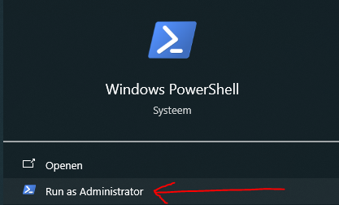

# Fullstack Containerized Project

This repository is an ongoing CI/CD project with fullstack technology examples in an containerized environment. 

## Installatie
Preconditions:

MAC: [Install Brew](https://docs.brew.sh/Installation)

WINDOWS: installeer Git (https://git-scm.com/downloads)
GIT Gui starten -> Clone Existing Repository ->
Source Location: https://github.com/dhomi/fullstack_conteinerized.git
Target Directory: c:\[..]\Techlab 
->Clone

Open een powerShell venster met administrator rechten




Daarna,

MAC: in shell: ./install.sh

Windows: in powerShell (met admin rechten): .\install.cmd

### Opstarten
MAC: in shell: ./startup.sh
Windows: in powerShell (met admin rechten): .\startup.cmd

  voor MAC:
  Open een git-shell (of andere linux terminal)
  check dat startup.sh  executable is, anders handmatig zelf doen:  chmod +x startup.sh

### Stoppen
MAC: in shell: ./stop.sh
Windows: in powerShell (met admin rechten): .\stop.cmd

### Chaos testing
dashboard is dus hier te zien: http://localhost:2333/

#### chaos uitvoeren
via UI/dashboard: Selecteer de techlab namespace, en de grafana app. 
Maak een experiment door POD KIlL en Submit deze allemaal 

CLI:
...zorg dat de betreffende name van een chaos experiment eerst ge-archived is in de experiments dashboard van de chaos mesh...

'kubectl apply -f chaos/podFailure_middleware_35s.yaml'

check de middleware het niet doet, wacht dan 35 seconden en dan zou de k8 de betreffende pod weer id lucht moeten laten draaien

Experiment deleten met: 
'kubectl delete -f chaos/podFailure_middleware_35s.yaml'

#### manuele installatie en opstartprocedure:
https://chaos-mesh.org/docs/production-installation-using-helm/
of doe: 
- kubectl create ns chaos-mesh
- helm install chaos-mesh chaos-mesh/chaos-mesh -n=chaos-mesh --version 2.7.0
- helm upgrade chaos-mesh chaos-mesh/chaos-mesh -n=chaos-mesh --version 2.7.0 --set dashboard.securityMode=false

kubectl port-forward -n chaos-mesh svc/chaos-dashboard 2333:2333

### Monitor
Grafana is a monitoring tool at http://localhost:4000

- Monitoring dashboard is the 'TechLab backend monitor'
- Grafana gets data from InfluxDB:8086, and Influx gets data every few seconds from Telegram scraper (on backend number)

### Fetch Local IP address

MAC: ```ipconfig | grep IPv4 | awk 'END{print}'```  
Windows: gitbash  

### View the Front- and Backend 
- Frontend is located at http://localhost:8001/
- Backend (Swagger) is located at http://localhost:8000/docs#/

### E2E tests
From the shell (or other CLI tool) navigate to folder "e2e" and run the test with "act"

```cd e2e
act
```
### JMeter
Navigate to folder "jmeter" and start "act"

```cd jmeter
act
```
### als de containers niet lukken
Start the container: docker-compose up --build
- After "docker-compose" go to dashboard at http://localhost:4000/
- At the end of the build you will also see the Local IP and the Network IP

## TODO
- Chaos testing: https://github.com/chaos-mesh/chaos-mesh
- Create an architectural picture to explain what and how this project works
- Extra README instructions
- Wait time or time sleep when you execute the startup.sh. when you start the first time the script it doesnt wait till the pod is deployed with the status running. It will throw an error.
