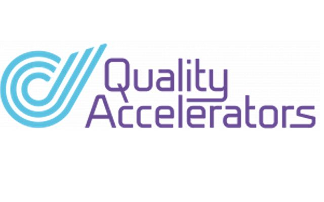

# Fullstack Containerized Project

Dit repository is een CI/CD project met fullstack technologie in een containerized omgeving.

## Installatie
### MAC:
1. [Install Brew](https://docs.brew.sh/Installation)
2. In shell: `./install.sh`

### WINDOWS:
1. Installeer [Git](https://git-scm.com/downloads)
2. Optioneel Git opties in de verkenner menu [TortoiseGit] (https://tortoisegit.org/download/)
3. Clone repository: `https://github.com/dhomi/fullstack_conteinerized.git`
4. Open PowerShell met admin rechten en voer uit: `.\install.cmd`

## Opstarten
### MAC:
1. In shell: `./startup.sh`
2. Zorg dat `startup.sh` executable is: `chmod +x startup.sh`

### WINDOWS:
1. In PowerShell met admin rechten: `.\startup.cmd`

## JMeter Testing
- cd jmeter
- act

## Chaos Testing
Dashboard: [http://localhost:2333/](http://localhost:2333/)

### Via UI:
1. Selecteer de techlab namespace en de grafana app.
2. Maak een experiment door POD KILL en submit.

### Via CLI:
1. Archiveer bestaande chaos experimenten.
2. Voer uit: `cd chaos/ && kubectl apply -f ./kill_grafana_pod.yaml`

## E2E Testing
- cd e2e
- act

## URL's
- Swagger: http://localhost:8000/docs#
- Order manager: http://localhost:8001/ordermanagement
- Chaos Testing: http://localhost:2333
- Grafana: http://localhost:4000
- Database: localhost:3306 (root:password)
